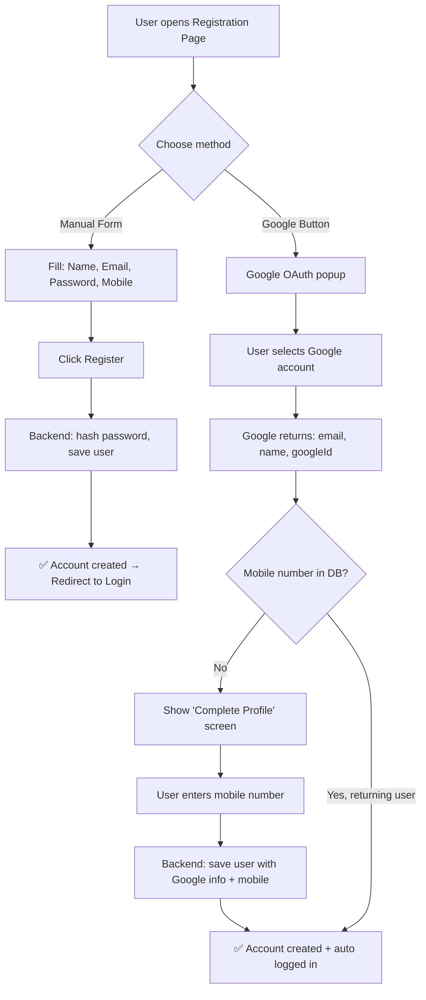
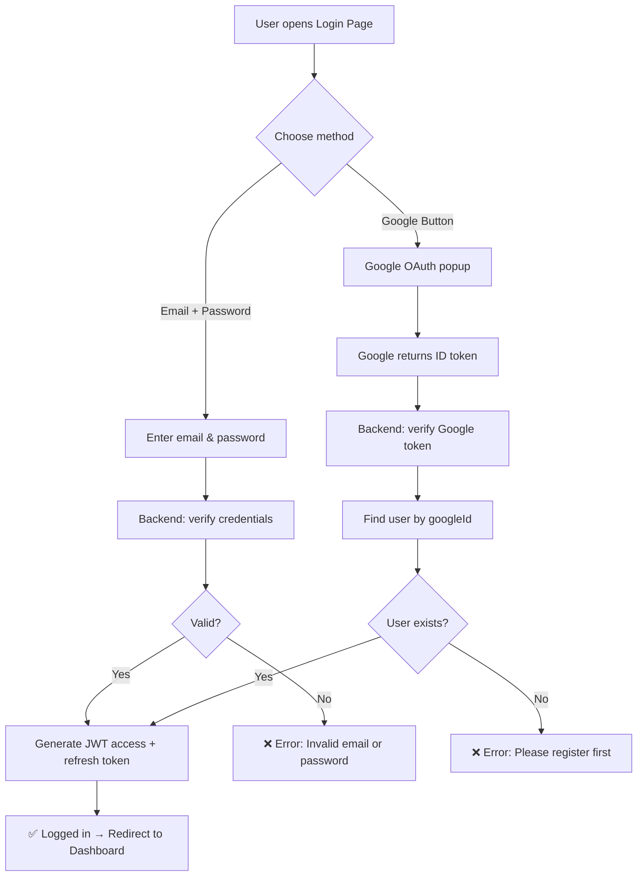
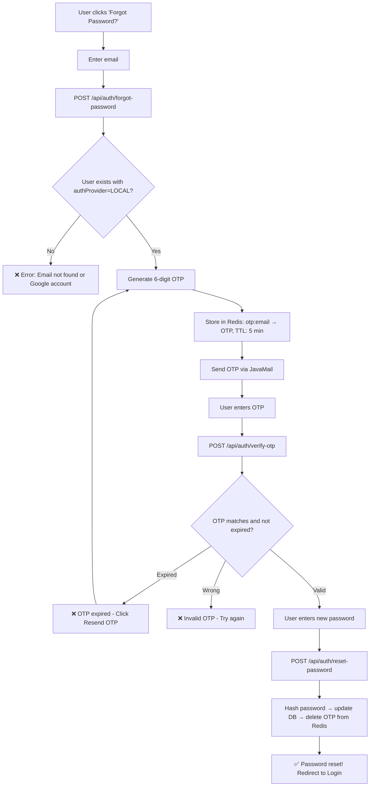
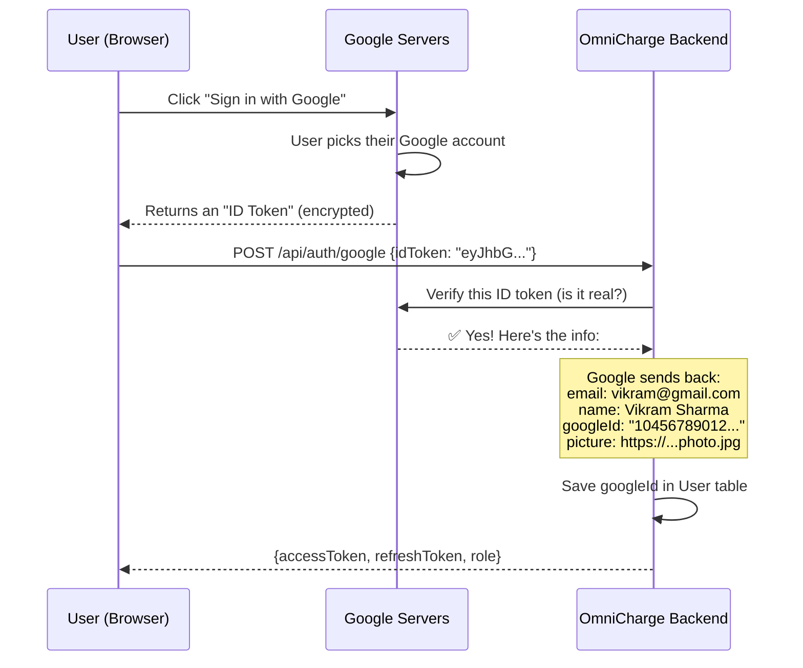
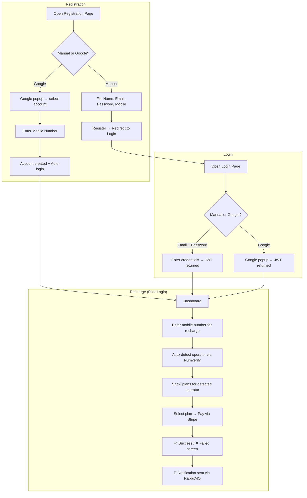

# OmniCharge – Authentication Flow (Detailed Illustration)

---

## Your 3 Questions Answered

---

## Q1: Registration Page — What does the user see?

The user has **TWO ways** to register:

```
┌─────────────────────────────────────────┐
│          Welcome to OmniCharge          │
│        Create your account              │
│                                         │
│  ┌───────────────────────────────────┐  │
│  │  Full Name     [________________] │  │
│  │  Email         [________________] │  │
│  │  Password      [________________] │  │
│  │  Mobile Number [+91 ____________] │  │
│  │                                   │  │
│  │      [ 🔵 Register ]             │  │
│  └───────────────────────────────────┘  │
│                                         │
│             ── OR ──                    │
│                                         │
│     [ G  Sign up with Google ]          │
│                                         │
│  Already have an account? Login         │
└─────────────────────────────────────────┘
```

### Option A: Manual Registration (Fill the form)

User enters **4 fields** themselves:

| Field | Required | Example |
|---|---|---|
| Full Name | ✅ | Vikram Sharma |
| Email | ✅ | vikram@gmail.com |
| Password | ✅ | ●●●●●●●● |
| Mobile Number | ✅ | +91 98765 43210 |

Then clicks **Register** → account created → redirected to login.

### Option B: Google Sign-In (One-click)

1. User clicks **"Sign up with Google"** button
2. Google popup appears → user picks their Google account
3. Google gives us: `email`, `name`, `googleId` (automatic — user doesn't type anything)
4. **But we still need the mobile number!** → So after Google sign-in, user sees:

```
┌─────────────────────────────────────────┐
│     Almost done! Complete your profile  │
│                                         │
│     Welcome, Vikram Sharma!             │
│     vikram@gmail.com ✓                  │
│                                         │
│  Mobile Number  [+91 ____________]      │
│                                         │
│        [ Complete Registration ]        │
└─────────────────────────────────────────┘
```

> **Yes, you are correct!** — Mobile number is always required regardless of registration method, because it's needed for recharges.

### Full Registration Flow Diagram



---

## Q2: Login Page — How does it work?

Once registered, the user **logs in** using the **same method they registered with**:

```
┌─────────────────────────────────────────┐
│          Welcome to OmniCharge          │
│        Login to your account            │
│                                         │
│  ┌───────────────────────────────────┐  │
│  │  Email         [________________] │  │
│  │  Password      [________________] │  │
│  │                                   │  │
│  │       [ 🔵 Login ]               │  │
│  │                                   │  │
│  │   Forgot Password? ← CLICK HERE  │  │
│  └───────────────────────────────────┘  │
│                                         │
│             ── OR ──                    │
│                                         │
│     [ G  Sign in with Google ]          │
│                                         │
│  Don't have an account? Register        │
└─────────────────────────────────────────┘
```

### Login Option A: Email + Password
- User who registered manually enters email & password
- Backend verifies credentials → returns JWT token → user logged in

### Login Option B: Google Sign-In
- User who registered via Google clicks **"Sign in with Google"**
- Google popup → selects account → backend verifies Google token
- Finds existing user by `googleId` → returns JWT → logged in
- **No password needed** — Google handles authentication

### Login Flow Diagram



> **Key Point**: A user who registered with Google **can only login with Google**. A user who registered manually **can only login with email/password**. This avoids confusion.

---

## Q4: Password Reset (Forgot Password) — Only for Manual Users

When a manual user clicks **"Forgot Password?"** on the login page:

### Step 1: Enter Email
```
┌─────────────────────────────────────────┐
│          Forgot Password                │
│                                         │
│  Enter your registered email to         │
│  receive a password reset OTP.          │
│                                         │
│  Email  [________________________]      │
│                                         │
│        [ Send OTP ]                     │
│                                         │
│  Back to Login                          │
└─────────────────────────────────────────┘
```
Backend: Validates email → checks `authProvider=LOCAL` → generates **6-digit OTP** → stores in Redis (key: `otp:{email}`, TTL: **5 minutes**) → sends OTP via **JavaMail**.

### Step 2: Enter OTP
```
┌─────────────────────────────────────────┐
│          Verify OTP                     │
│                                         │
│  An OTP has been sent to                │
│  v****m@gmail.com                       │
│                                         │
│  Enter OTP:                             │
│  ┌───┬───┬───┬───┬───┬───┐             │
│  │ 4 │ 8 │ 2 │ 7 │ 1 │ 5 │             │
│  └───┴───┴───┴───┴───┴───┘             │
│                                         │
│  ⏱  Time remaining: 4:23               │
│                                         │
│        [ Verify OTP ]                   │
│                                         │
│  Didn't receive? [ Resend OTP ]         │
│  (Resend button appears after timeout)  │
└─────────────────────────────────────────┘
```

### Step 3: Set New Password
```
┌─────────────────────────────────────────┐
│          Reset Password                 │
│                                         │
│  OTP Verified ✅                        │
│                                         │
│  New Password      [________________]   │
│  Confirm Password  [________________]   │
│                                         │
│        [ Reset Password ]               │
└─────────────────────────────────────────┘
```

### Password Reset Flow Diagram



> **Resend OTP**: The "Resend" button appears on the frontend after the 5-minute timer expires. Clicking it calls `/api/auth/forgot-password` again, generating a new OTP and overwriting the old one in Redis.

---

## Q3: What is `googleId`?

### Simple Explanation

When you sign in with Google, **Google assigns a unique ID to every Google account**. This is the `googleId`.

| What it is | Example |
|---|---|
| Your email | vikram@gmail.com |
| Your name | Vikram Sharma |
| Your **googleId** | `104567890123456789012` |

- It's a **long number string** that Google generates internally
- It **never changes** even if you change your Gmail name or profile picture
- It's the **safest way** to identify a Google user (email can theoretically be changed, but `googleId` can't)

### Where it comes from



### In the database

```
users table:
┌────┬───────────────────┬───────────────┬────────────────┬──────────────────────┬────────────┐
│ id │ email             │ full_name     │ mobile_number  │ google_id            │ password   │
├────┼───────────────────┼───────────────┼────────────────┼──────────────────────┼────────────┤
│ 1  │ vikram@gmail.com  │ Vikram Sharma │ 9876543210     │ 104567890123456789012│ NULL       │ ← Google user
│ 2  │ rahul@yahoo.com   │ Rahul Verma   │ 8765432109     │ NULL                 │ $2a$10$... │ ← Manual user
│ 3  │ admin@omni.com    │ Admin         │ 9999999999     │ NULL                 │ $2a$10$... │ ← Admin (manual)
└────┴───────────────────┴───────────────┴────────────────┴──────────────────────┴────────────┘
```

- **Google user** → has `google_id`, `password` is NULL
- **Manual user** → has `password` (BCrypt hash), `google_id` is NULL
- Both have `email` and `mobile_number`

---

## Updated User Entity (Supporting Both Methods)

```java
@Entity
@Table(name = "users")
public class User extends Auditable {

    @Id
    @GeneratedValue(strategy = GenerationType.IDENTITY)
    private Long id;

    @Column(unique = true, nullable = false)
    private String email;

    @Column(nullable = false)
    private String fullName;

    @Column(unique = true)
    private String mobileNumber;         // Required, collected post-Google-signup or in manual form

    @Column(unique = true)
    private String googleId;             // NULL for manual users, set for Google users

    private String password;             // NULL for Google users, BCrypt hash for manual users

    @Enumerated(EnumType.STRING)
    private Role role;                   // ROLE_USER or ROLE_ADMIN

    @Enumerated(EnumType.STRING)
    private AuthProvider authProvider;   // LOCAL or GOOGLE

    private Boolean isActive = true;
}
```

### New Enum: `AuthProvider`
```java
public enum AuthProvider {
    LOCAL,   // Registered with email + password
    GOOGLE   // Registered with Google Sign-In
}
```

---

## Full End-to-End User Journey



---

## API Gateway Security Features

### 1. JWT Authentication
- All protected endpoints require valid JWT token in `Authorization: Bearer <token>` header
- JWT is validated at Gateway before forwarding to microservices
- Token blacklist checked in Redis (for logout functionality)
- User context (userId, role, email) added to request headers for downstream services

### 2. Rate Limiting (Production Ready)
**Purpose**: Prevent API abuse and DDoS attacks

**Configuration**:
- **Rate**: 2 requests per second per user
- **Burst Capacity**: 3 requests (allows short bursts)
- **Key Resolver**: Uses `X-User-Id` header (falls back to IP address for unauthenticated requests)
- **Response**: `429 TOO_MANY_REQUESTS` when limit exceeded

**Protected Routes**:
- `/api/auth/**` - User Service (login, register, refresh token)
- `/api/users/**` - User Service (user management)
- `/api/payments/**` - Payment Service (process payments, history)
- `/api/admin/payments/**` - Payment Service (admin endpoints)
- `/api/operators/**` - Operator Service (operator detection, plans)
- `/api/admin/operators/**` - Operator Service (admin endpoints)
- `/api/recharges/**` - Recharge Service (create recharge, history)
- `/api/admin/recharges/**` - Recharge Service (admin endpoints)

**Filter Order**:
1. **JWT Authentication Filter** (Order: -1) - Runs FIRST
   - Validates JWT token
   - Checks token blacklist in Redis
   - Adds user context headers (X-User-Id, X-User-Role, X-User-Email)
2. **Rate Limiting Filter** (Order: 0) - Runs SECOND
   - Uses X-User-Id from JWT filter for rate limiting
   - Tracks requests per user in Redis
   - Returns 429 if limit exceeded

**Impact on Auth Tokens**:
- ✅ **No impact on token generation** - Rate limiting happens AFTER JWT validation
- ✅ **No impact on refresh tokens** - `/api/auth/refresh-token` is rate-limited but allows normal usage
- ✅ **Login/Register protected** - Prevents brute force attacks
- ✅ **User-specific limits** - Each user has their own rate limit quota

**Testing Rate Limiting**:
```bash
# Make rapid requests (>3 per second) to see 429 error
for i in {1..10}; do
  curl -H "Authorization: Bearer <token>" http://localhost:8080/api/payments/history
done

# Expected: First 3 requests succeed, rest return 429 TOO_MANY_REQUESTS
```

**Rate Limit Response**:
```json
{
  "timestamp": "2026-03-21T19:15:00",
  "status": 429,
  "error": "Too Many Requests",
  "message": "You have exceeded the rate limit. Please try again later.",
  "path": "/api/payments/history"
}
```

### 3. Circuit Breaker (Payment Service)
**Purpose**: Prevent cascading failures when Stripe API is down

**Configuration**:
- **Sliding Window**: 10 calls
- **Minimum Calls**: 5 (circuit evaluates after 5 calls)
- **Failure Threshold**: 50% (circuit opens if >50% fail)
- **Wait Duration**: 30 seconds (circuit stays open for 30s)
- **Slow Call Threshold**: 5 seconds (calls >5s considered slow)

**Behavior**:
- When Stripe API fails repeatedly, circuit opens
- Subsequent payment requests fail immediately with FAILED status
- After 30 seconds, circuit enters half-open state (allows 3 test calls)
- If test calls succeed, circuit closes; if they fail, circuit reopens

**Fallback**:
- Payment fails gracefully with `status: FAILED`
- Transaction saved to database with FAILED status
- User receives clear error message
- No cascading failures to other services

---

## Security Best Practices Implemented

1. ✅ **JWT Validation at Gateway** - Single point of authentication
2. ✅ **Token Blacklist** - Logout invalidates tokens immediately
3. ✅ **Rate Limiting** - Prevents brute force and DDoS attacks
4. ✅ **Circuit Breaker** - Handles external service failures gracefully
5. ✅ **User Isolation** - Users can only access their own data
6. ✅ **Role-Based Access** - Admin endpoints require ADMIN role
7. ✅ **Idempotency Keys** - Prevents duplicate payment charges
8. ✅ **Password Hashing** - BCrypt with salt for manual users
9. ✅ **OAuth 2.0** - Secure Google Sign-In integration
10. ✅ **HTTPS Ready** - All services support secure communication
