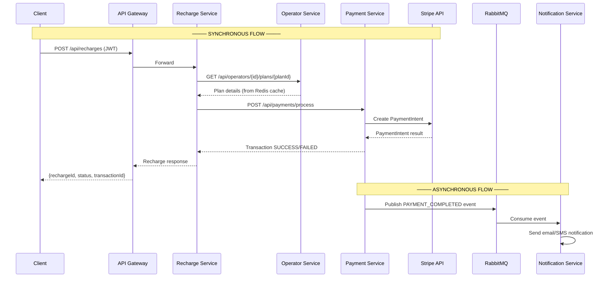
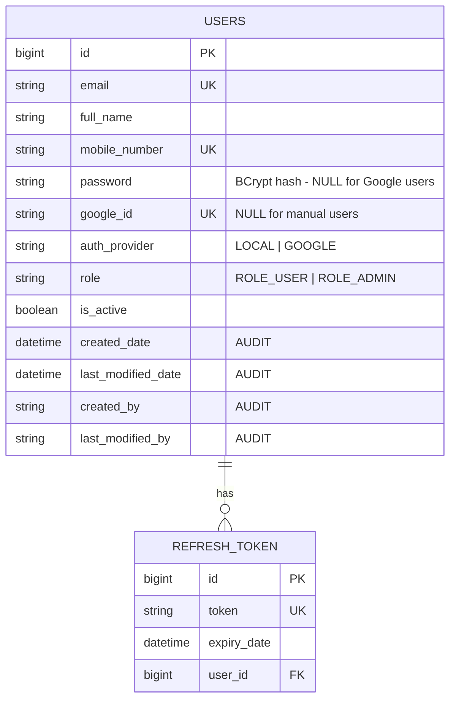
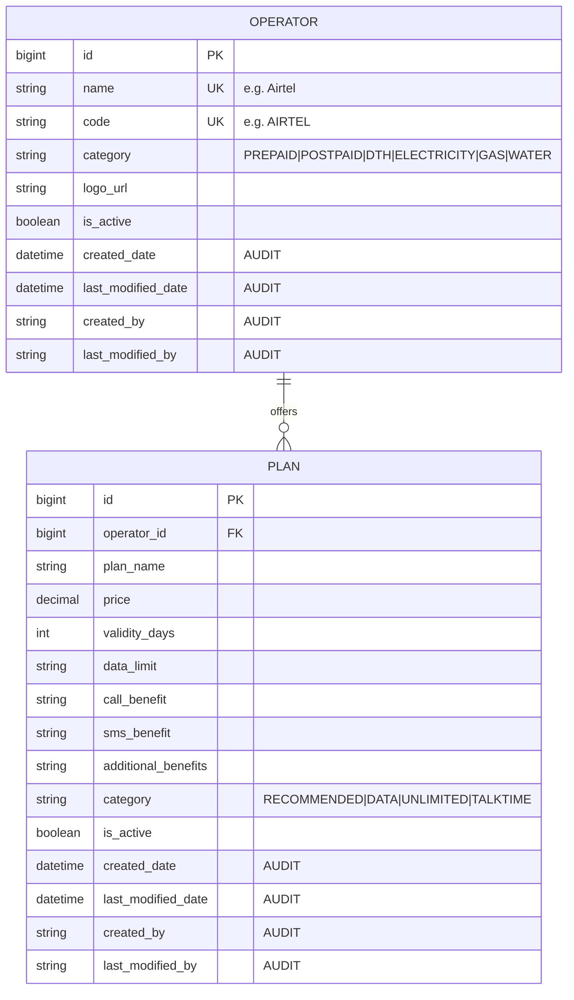
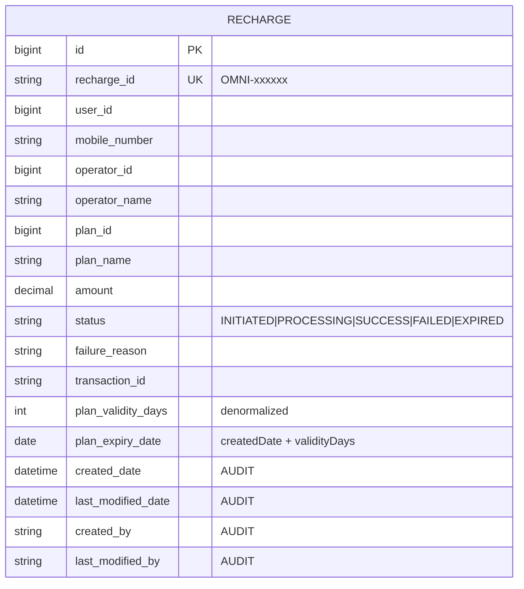
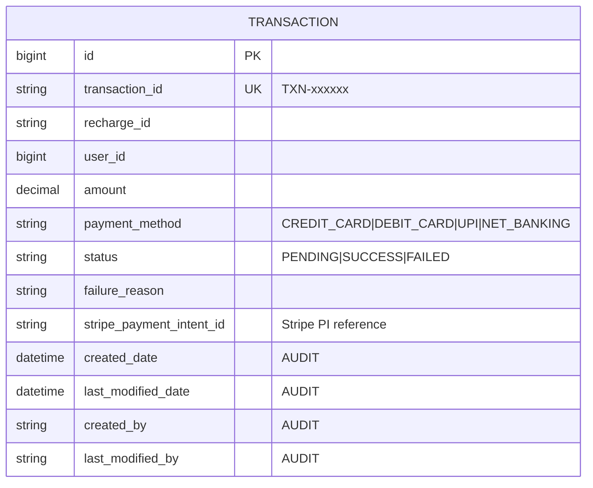
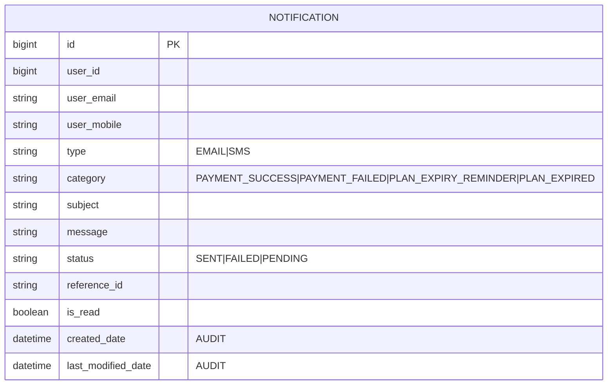
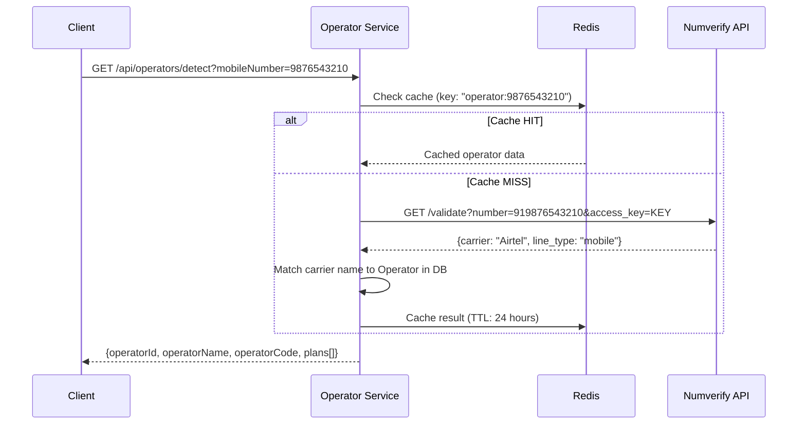
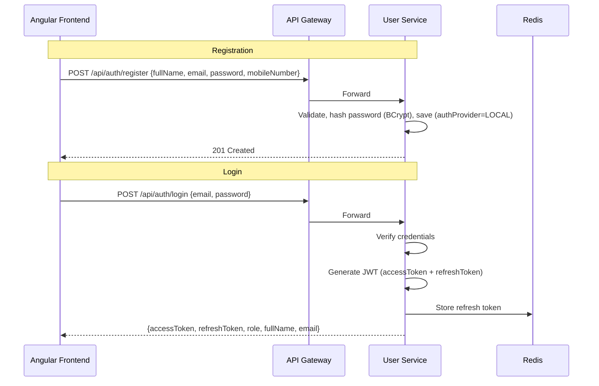
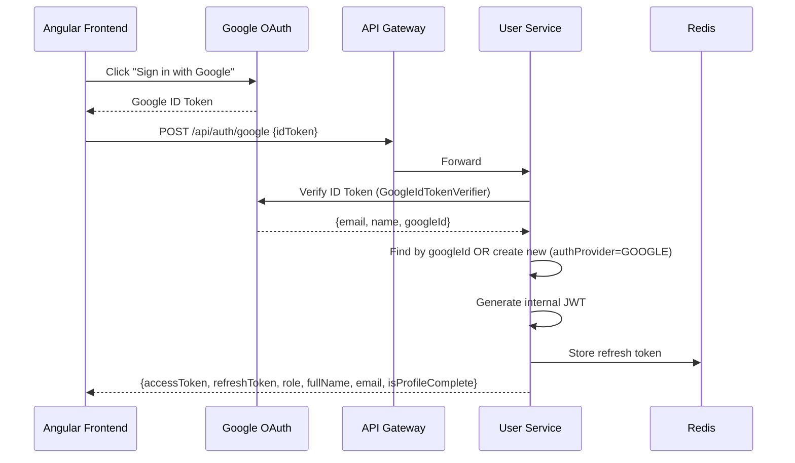

# OmniCharge – Master Implementation Plan (Backend) — v2

> **Mobile Recharge & Utility Payment Platform**
> Java Spring Boot · Microservices · Google OAuth 2.0 · Stripe · Redis · RabbitMQ · MySQL

---

## User Review — Changes Applied (v2)

> [!IMPORTANT]
> All 12 requested changes have been incorporated:
> 1. ✅ **MySQL** as database
> 2. ✅ **Numverify API** (free 100 req/month) for auto-detecting mobile operator
> 3. ✅ Auto-detect operator → auto-fetch plans (users no longer browse operators)
> 4. ✅ Removed `profileImageUrl` from User entity
> 5. ✅ Removed `gatewayReferenceId` from Transaction entity
> 6. ✅ Payment flow documented as **synchronous**; post-payment notification is **asynchronous** via RabbitMQ
> 7. ✅ **Stripe** payment gateway integrated
> 8. ✅ `config-server` and `discovery-server` are **separate standalone projects**
> 9. ✅ All config uses `.properties` / `bootstrap.properties` (no `.yml`)
> 10. ✅ **Dual Auth**: Manual (email/password) registration + **Google Sign-In (OAuth 2.0)** — both supported
> 11. ✅ **Redis** used for JWT blacklisting, session caching, operator/plan caching, and rate limiting
> 12. ✅ Stripe integration fully documented

---

## 1. Solution Overview

| Concern | Decision |
|---|---|
| Architecture | Microservices (Spring Cloud) |
| Auth | **Dual**: Manual (email/password) + **Google OAuth 2.0**, both issue internal JWT, role-based (`USER`, `ADMIN`) |
| Database | **MySQL** (one logical DB per service) |
| ORM | Spring Data JPA + Hibernate |
| Auditing | **Spring Data JPA Auditing** (`@CreatedDate`, `@LastModifiedDate`, `@CreatedBy`, `@LastModifiedBy`) |
| Caching | **Redis** (JWT blacklist, operator/plan cache, rate limiting) |
| Messaging | RabbitMQ (async notifications + plan expiry events) |
| Payment | **Stripe** (Payment Intent API) |
| Email | **JavaMail** (spring-boot-starter-mail) — real emails for payment confirmation, OTP, plan expiry |
| SMS | Stub (real SMS API to be configured later) |
| Operator Detection | **Numverify API** (free tier — 100 lookups/month) + local prefix fallback |
| API Docs | Springdoc OpenAPI (Swagger UI) |
| Resilience | Resilience4j (circuit breaker, retry) |
| Observability | Spring Boot Actuator, SLF4J/Logback |
| Testing | JUnit 5, Mockito, MockMvc |
| DevOps | Docker, docker-compose, GitHub Actions |
| Config Files | **`.properties`** and **`bootstrap.properties`** only (no `.yml`) |

---

## 2. High-Level Architecture

```
                         ┌──────────────────────┐
                         │    Angular Frontend   │
                         │  (USER + ADMIN UIs)   │
                         └──────────┬───────────┘
                                    │ HTTP
                         ┌──────────▼───────────┐
                         │     API Gateway       │
                         │  (Spring Cloud GW)    │
                         │  JWT Filter + Routes  │
                         └──────────┬───────────┘
                                    │
              ┌─────────────────────┼─────────────────────┐
              │                     │                     │
    ┌─────────▼────────┐ ┌─────────▼────────┐ ┌─────────▼────────┐
    │   User Service   │ │ Operator Service │ │ Recharge Service │
    │ (Manual + Google │ │ (Operators+Plans │ │ (Recharge Flow)  │
    │  Auth + JWT)     │ │  + Numverify)    │ │                  │
    └──────────────────┘ └──────────────────┘ └────────┬─────────┘
           │                    │                      │ SYNC REST
           │ Redis              │ Redis                │
           │ (JWT blacklist)    │ (plan cache)  ┌──────▼──────────┐
           ▼                    ▼               │ Payment Service │
    ┌────────────┐       ┌────────────┐        │ (Stripe + TXN)  │
    │   Redis    │       │   Redis    │        └────────┬─────────┘
    └────────────┘       └────────────┘                 │ RabbitMQ (ASYNC)
                                                ┌───────▼─────────┐
                                                │Notification Svc │
                                                │ (Email/SMS)     │
                                                └─────────────────┘

    ┌─────────────────┐  ┌─────────────────┐
    │  Config Server  │  │  Eureka Server  │
    │ (SEPARATE PROJ) │  │ (SEPARATE PROJ) │
    └─────────────────┘  └─────────────────┘
```

### Sync vs Async Payment Flow



> [!NOTE]
> **The payment is fully synchronous** — the user waits for Stripe to process and gets an immediate SUCCESS/FAILED response. **Only the notification** (email/SMS after payment) is asynchronous via RabbitMQ, so the user doesn't wait for email delivery.

---

## 3. Project Structure (9 Independent Microservices)

> **Architecture Decision**: Each service is a **standalone Spring Boot project** with its own `pom.xml`, independently deployable, following true microservices principles.

### Project 1: `omnicharge-config-server` (Standalone)
```
omnicharge-config-server/
├── pom.xml                          # Independent project
└── src/main/
    ├── java/com/omnicharge/config/ConfigServerApplication.java
    └── resources/
        ├── application.properties
        └── config/                  # Externalized configs for all services
            ├── user-service.properties
            ├── operator-service.properties
            ├── recharge-service.properties
            ├── payment-service.properties
            ├── notification-service.properties
            └── api-gateway.properties
```

### Project 2: `omnicharge-discovery-server` (Standalone)
```
omnicharge-discovery-server/
├── pom.xml                          # Independent project
└── src/main/
    ├── java/com/omnicharge/discovery/DiscoveryServerApplication.java
    └── resources/
        ├── application.properties
        └── bootstrap.properties
```

### Project 3: `omnicharge-common` (Standalone Shared Library)
```
omnicharge-common/
├── pom.xml                          # Independent library project
└── src/main/java/com/omnicharge/common/
    ├── dto/                         # ApiResponse, PagedResponse, ErrorResponse
    ├── exception/                   # Custom exceptions + GlobalExceptionHandler
    ├── audit/                       # Auditable base entity, AuditorAware
    ├── security/                    # JWT utility, constants
    └── event/                       # RabbitMQ event DTOs
```

### Project 4: `api-gateway` (Standalone)
```
api-gateway/
├── pom.xml                          # Independent project
└── src/main/
    ├── java/com/omnicharge/gateway/
    │   ├── ApiGatewayApplication.java
    │   ├── config/                  # Route config, CORS config
    │   └── filter/                  # JwtAuthenticationFilter
    └── resources/
        ├── application.properties
        └── bootstrap.properties
```

### Project 5: `user-service` (Standalone)
```
user-service/
├── pom.xml                          # Independent project
└── src/main/java/com/omnicharge/user/
    ├── UserServiceApplication.java
    ├── entity/
    ├── repository/
    ├── service/
    ├── controller/
    ├── dto/
    └── config/                      # SecurityConfig, OAuth2Config, RedisConfig
```

### Project 6: `operator-service` (Standalone)
```
operator-service/
├── pom.xml                          # Independent project
└── src/main/java/com/omnicharge/operator/
    ├── OperatorServiceApplication.java
    ├── entity/
    ├── repository/
    ├── service/
    ├── controller/
    ├── client/                      # NumverifyClient (RestTemplate)
    ├── dto/
    └── config/                      # RedisConfig (plan caching)
```

### Project 7: `recharge-service` (Standalone)
```
recharge-service/
├── pom.xml                          # Independent project
└── src/main/java/com/omnicharge/recharge/
    ├── RechargeServiceApplication.java
    ├── entity/
    ├── repository/
    ├── service/
    ├── controller/
    ├── client/                      # Feign: Operator, Payment
    └── dto/
```

### Project 8: `payment-service` (Standalone)
```
payment-service/
├── pom.xml                          # Independent project
└── src/main/java/com/omnicharge/payment/
    ├── PaymentServiceApplication.java
    ├── entity/
    ├── repository/
    ├── service/                     # StripePaymentService
    ├── controller/
    ├── dto/
    └── config/                      # StripeConfig, RabbitMQ producer
```

### Project 9: `notification-service` (Standalone)
```
notification-service/
├── pom.xml                          # Independent project
└── src/main/java/com/omnicharge/notification/
    ├── NotificationServiceApplication.java
    ├── entity/
    ├── consumer/                    # RabbitMQ listeners
    ├── service/
    ├── controller/
    └── config/
```

### Workspace Organization
```
D:/OmniCharge/                       # Root workspace folder
├── omnicharge-config-server/        # Independent project 1
├── omnicharge-discovery-server/     # Independent project 2
├── omnicharge-common/               # Independent project 3 (library)
├── api-gateway/                     # Independent project 4
├── user-service/                    # Independent project 5
├── operator-service/                # Independent project 6
├── recharge-service/                # Independent project 7
├── payment-service/                 # Independent project 8
├── notification-service/            # Independent project 9
├── docker/
│   └── docker-compose.yml
└── docs/
    ├── implementation_plan.md
    ├── service_implementation_plan.md
    └── auth_flow_illustration.md
```

---

## 4. Roles & Access Control Matrix

| Endpoint Area | USER | ADMIN |
|---|---|---|
| Register (manual form) | ✅ | ✅ |
| Google OAuth Login | ✅ | ✅ |
| Login (email/password) | ✅ | ✅ |
| View/update own profile | ✅ | ✅ |
| **Auto-detect operator** (Numverify) | ✅ | ❌ |
| View auto-detected plans | ✅ | ❌ |
| Initiate recharge | ✅ | ❌ |
| View own recharge history | ✅ | ❌ |
| View own transactions | ✅ | ❌ |
| View own notifications | ✅ | ❌ |
| **Admin Dashboard stats** | ❌ | ✅ |
| **CRUD Operators** | ❌ | ✅ |
| **CRUD Plans** | ❌ | ✅ |
| **View all users** | ❌ | ✅ |
| **View all recharges** | ❌ | ✅ |
| **View all transactions** | ❌ | ✅ |
| **Manage user status** | ❌ | ✅ |

---

## 5. Database Entity Models (MySQL)

### 5.1 User Service — `omnicharge_user_db`



> **LOCAL user** → `password` filled, `google_id` NULL. **Google user** → `google_id` filled, `password` NULL. No `profileImageUrl`.

### 5.2 Operator Service — `omnicharge_operator_db`



### 5.3 Recharge Service — `omnicharge_recharge_db`



### 5.4 Payment Service — `omnicharge_payment_db`



> `gatewayReferenceId` removed. Only `stripe_payment_intent_id` kept (essential for Stripe reconciliation).

### 5.5 Notification Service — `omnicharge_notification_db`



---

## 6. Operator Auto-Detection (Numverify API)

### How It Works

When a user enters a mobile number, the system **automatically detects the operator**:



### Numverify API (Free Tier)
- **URL**: `http://apilayer.net/api/validate`
- **Free tier**: 100 requests/month
- **Returns**: `carrier`, `line_type`, `country_code`, `valid`
- **Fallback**: If Numverify quota exhausted → Indian mobile prefix lookup from a local prefix-to-operator mapping table

### User Flow Change
1. User enters mobile number → frontend calls `GET /api/operators/detect?mobileNumber=XXXXXXXXXX`
2. Backend auto-detects operator → returns operator ID + all active plans
3. User picks a plan → frontend calls `POST /api/recharges`
4. **User never needs to manually select an operator**

---

## 7. Authentication Flow (Dual: Manual + Google OAuth 2.0)

### Option A: Manual Registration + Login



### Option B: Google Sign-In



### Key Decisions
- **Both methods** supported side-by-side on the same registration/login page
- LOCAL users have `password` (BCrypt), Google users have `googleId` — mutually exclusive
- `authProvider` enum (`LOCAL` / `GOOGLE`) tracks which method the user registered with
- Internal JWT issued in both cases (used for all subsequent API calls)
- `ROLE_USER` assigned on registration; Admin accounts created via seed data
- Mobile number: required in manual registration form; collected post-login for Google users

---

## 8. Redis Usage Map

| Use Case | Service | Key Pattern | TTL |
|---|---|---|---|
| JWT Blacklist (logout) | User Service | `blacklist:{jti}` | Access token remaining time |
| Refresh Token Store | User Service | `refresh:{userId}` | 7 days |
| **Password Reset OTP** | User Service | `otp:{email}` | **5 minutes** |
| Operator Detection Cache | Operator Service | `operator:detect:{mobileNumber}` | 24 hours |
| Plan List Cache | Operator Service | `plans:operator:{operatorId}` | 1 hour |
| All Operators Cache | Operator Service | `operators:active` | 1 hour |
| Rate Limiting | API Gateway | `ratelimit:{clientIp}` | 1 minute |

---

## 9. Stripe Payment Integration

### Flow
1. Recharge Service calls Payment Service with `{rechargeId, userId, amount, paymentMethod}`
2. Payment Service creates a **Stripe PaymentIntent** (`stripe.paymentIntents.create()`)
3. For test mode: `amount` in smallest currency unit (paise), `currency: "inr"`
4. Stripe returns `paymentIntent.status` → `succeeded` / `requires_action` / `failed`
5. Payment Service maps Stripe result to our `SUCCESS` / `FAILED` status
6. Returns synchronous response with `transactionId` + `stripePaymentIntentId`

### Configuration
```properties
stripe.api.secret-key=${STRIPE_SECRET_KEY}
stripe.api.publishable-key=${STRIPE_PUBLISHABLE_KEY}
stripe.webhook.secret=${STRIPE_WEBHOOK_SECRET}
```

---

## 10. API Endpoint Summary

### 10.1 User Service (`/api/auth/**`, `/api/users/**`)

| Method | Endpoint | Access | Description |
|---|---|---|---|
| POST | `/api/auth/register` | Public | Manual registration (form) |
| POST | `/api/auth/login` | Public | Manual login (email + password) |
| POST | `/api/auth/google` | Public | Google OAuth login/register |
| POST | `/api/auth/refresh-token` | Public | Refresh access token |
| POST | `/api/auth/logout` | AUTH | Logout (blacklist JWT in Redis) |
| POST | `/api/auth/forgot-password` | Public | Send OTP to email (LOCAL users) |
| POST | `/api/auth/verify-otp` | Public | Verify OTP |
| POST | `/api/auth/reset-password` | Public | Reset password with verified OTP |
| GET | `/api/users/profile` | USER, ADMIN | Get own profile |
| PUT | `/api/users/profile` | USER, ADMIN | Update profile (fullName, mobile) |
| PUT | `/api/users/change-password` | USER, ADMIN | Change password (LOCAL users only) |
| GET | `/api/admin/users` | ADMIN | List all users (paginated) |
| GET | `/api/admin/users/{id}` | ADMIN | Get user by ID |
| PUT | `/api/admin/users/{id}/status` | ADMIN | Enable/disable user |
| GET | `/api/admin/dashboard/stats` | ADMIN | Dashboard summary counts |

### 10.2 Operator Service (`/api/operators/**`, `/api/plans/**`)

| Method | Endpoint | Access | Description |
|---|---|---|---|
| GET | `/api/operators/detect?mobileNumber=` | USER | **Auto-detect** operator + return plans |
| GET | `/api/operators/{id}/plans` | USER, ADMIN | Plans for operator |
| GET | `/api/plans/{id}` | USER, ADMIN | Plan details |
| GET | `/api/plans/search?category=&operatorId=` | USER, ADMIN | Search plans |
| POST | `/api/admin/operators` | ADMIN | Create operator |
| PUT | `/api/admin/operators/{id}` | ADMIN | Update operator |
| DELETE | `/api/admin/operators/{id}` | ADMIN | Soft-delete operator |
| POST | `/api/admin/operators/{id}/plans` | ADMIN | Create plan |
| PUT | `/api/admin/operators/plans/{id}` | ADMIN | Update plan |
| DELETE | `/api/admin/operators/plans/{id}` | ADMIN | Soft-delete plan |
| GET | `/api/admin/operators` | ADMIN | List all operators (incl. inactive) |

### 10.3 Recharge Service (`/api/recharges/**`)

| Method | Endpoint | Access | Description |
|---|---|---|---|
| POST | `/api/recharges` | USER | Initiate recharge |
| GET | `/api/recharges/{rechargeId}` | USER | Get recharge by ID |
| GET | `/api/recharges/history` | USER | Recharge history (paginated) |
| GET | `/api/recharges/status/{rechargeId}` | USER | Track status |
| GET | `/api/admin/recharges` | ADMIN | All recharges (paginated) |
| GET | `/api/admin/recharges/stats` | ADMIN | Recharge statistics |
| GET | `/api/internal/recharges/expiring?daysLeft=5` | INTERNAL | Recharges expiring in N days |
| GET | `/api/internal/recharges/expired-today` | INTERNAL | Recharges that expired today |
| PUT | `/api/internal/recharges/{id}/expire` | INTERNAL | Mark recharge as EXPIRED |

### 10.4 Payment Service (`/api/payments/**`)

| Method | Endpoint | Access | Description |
|---|---|---|---|
| POST | `/api/payments/process` | INTERNAL | Process Stripe payment (sync) |
| GET | `/api/payments/{transactionId}` | USER | Transaction details |
| GET | `/api/payments/history` | USER | Payment history |
| GET | `/api/admin/payments` | ADMIN | All transactions |
| GET | `/api/admin/payments/stats` | ADMIN | Payment stats |

### 10.5 Notification Service (`/api/notifications/**`)

| Method | Endpoint | Access | Description |
|---|---|---|---|
| GET | `/api/notifications` | USER | User's notifications |
| GET | `/api/notifications/{id}` | USER | Notification details |
| PUT | `/api/notifications/{id}/read` | USER | Mark as read |
| GET | `/api/notifications/unread-count` | USER | Unread count |
| GET | `/api/admin/notifications` | ADMIN | All notifications |

---

## 11. Port Allocation

| Service | Port |
|---|---|
| Config Server *(separate project)* | 8888 |
| Eureka Discovery *(separate project)* | 8761 |
| API Gateway | 8080 |
| User Service | 8081 |
| Operator Service | 8082 |
| Recharge Service | 8083 |
| Payment Service | 8084 |
| Notification Service | 8085 |
| MySQL | 3306 |
| Redis | 6379 |
| RabbitMQ | 5672 / 15672 |

---

## 12. Technology Versions

| Technology | Version |
|---|---|
| Java | **21** |
| Spring Boot | **3.5.11** |
| Spring Cloud | **2025.0.1** |
| MySQL | 8.0+ |
| Redis | 7+ |
| RabbitMQ | 3.12+ |
| Stripe Java SDK | 24.x |
| Google API Client | 2.x |
| JavaMail (spring-boot-starter-mail) | (managed by Spring Boot) |
| Springdoc OpenAPI | 2.3.x |
| Resilience4j | 2.1.x |
| Docker | 24+ |
| Maven | 3.9+ |

---

## 13. Verification Plan

### Automated Tests
- Unit tests (JUnit 5 + Mockito) for all services
- Controller tests via `@WebMvcTest` + MockMvc
- Repository tests via `@DataJpaTest` with H2
- Run: `mvn test` in each service directory

### Integration
- `docker-compose up` → full stack
- End-to-end: Google login → enter number → auto-detect operator → select plan → pay via Stripe → verify notification
- Swagger UI at `http://localhost:8080/swagger-ui.html`

### Manual
- Postman collection in `docs/`
- Eureka dashboard: `http://localhost:8761`
- RabbitMQ admin: `http://localhost:15672`
- Actuator health: `http://localhost:{port}/actuator/health`

---

## 14. Building & Running Services

### Build omnicharge-common (Required First)
```bash
cd omnicharge-common
mvn clean install
```
This installs the shared library to your local Maven repository (~/.m2/repository).

### Build Individual Services
```bash
cd user-service
mvn clean package
java -jar target/user-service-1.0.0.jar
```

### Build All Services (Script)
```bash
# build-all.sh
services=("config-server" "discovery-server" "omnicharge-common" "api-gateway" "user-service" "operator-service" "recharge-service" "payment-service" "notification-service")

for service in "${services[@]}"; do
    echo "Building $service..."
    cd $service
    mvn clean package -DskipTests
    cd ..
done
```

> [!IMPORTANT]
> See [service_implementation_plan.md](service_implementation_plan.md) for full class-level documentation of every service.
