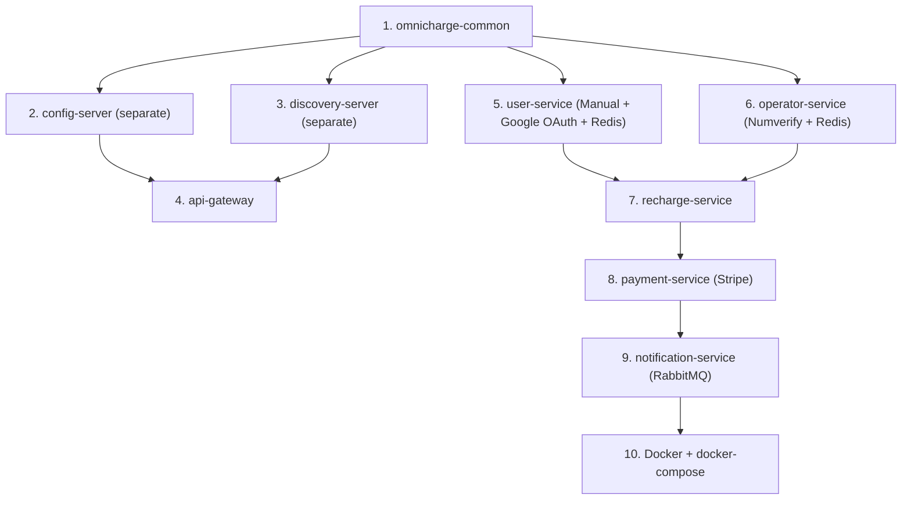

# OmniCharge – Per-Service Detailed Implementation Plan — v2

> Full documentation of every class, method, and configuration for each service.
> **Changes applied**: MySQL, Manual + Google OAuth 2.0 dual auth, Stripe, Redis, Numverify, .properties, removed profileImageUrl & gatewayReferenceId.

---

## Service 1: `omnicharge-common` (Shared Library)

### Package: `com.omnicharge.common.audit`

#### `Auditable.java`
- `@MappedSuperclass`, `@EntityListeners(AuditingEntityListener.class)`
- Fields: `createdDate`, `lastModifiedDate`, `createdBy`, `lastModifiedBy`

#### `AuditConfig.java`
- `@EnableJpaAuditing(auditorAwareRef = "auditorAware")`
- `AuditorAware<String>` → extracts username from `SecurityContextHolder`

### Package: `com.omnicharge.common.dto`

| DTO | Fields |
|---|---|
| `ApiResponse<T>` | `success`, `message`, `data`, `timestamp` |
| `PagedResponse<T>` | `content`, `page`, `size`, `totalElements`, `totalPages` |
| `ErrorResponse` | `status`, `message`, `errors`, `timestamp`, `path` |

### Package: `com.omnicharge.common.exception`

| Class | HTTP |
|---|---|
| `ResourceNotFoundException` | 404 |
| `BadRequestException` | 400 |
| `UnauthorizedException` | 401 |
| `ForbiddenException` | 403 |
| `DuplicateResourceException` | 409 |
| `ServiceUnavailableException` | 503 |
| `GlobalExceptionHandler` | `@RestControllerAdvice` |

### Package: `com.omnicharge.common.security`

| Class | Description |
|---|---|
| `JwtConstants` | Secret key, expiry, header names |
| `SecurityConstants` | Public paths, role constants |

### Package: `com.omnicharge.common.event`

| DTO | Fields | Publisher |
|---|---|---|
| `RechargeCompletedEvent` | `rechargeId`, `userId`, `mobileNumber`, `operatorName`, `planName`, `amount`, `status`, `transactionId`, `timestamp` | Recharge Svc |
| `PaymentCompletedEvent` | `transactionId`, `rechargeId`, `userId`, `amount`, `status`, `paymentMethod`, `timestamp` | Payment Svc |

---

## Service 2: `user-service` (Port 8081)

**Database**: MySQL `omnicharge_user_db`

### Entity: `User.java` extends `Auditable`

| Field | Type | Notes |
|---|---|---|
| `id` | Long | `@Id @GeneratedValue(strategy = IDENTITY)` |
| `email` | String | `unique`, `@Email`, `@NotBlank` |
| `fullName` | String | `@NotBlank` |
| `mobileNumber` | String | `unique`, `@Pattern("^[6-9]\\d{9}$")`, required |
| `password` | String | nullable — BCrypt hash for LOCAL users, NULL for Google users |
| `googleId` | String | unique, nullable — set only for Google users |
| `authProvider` | AuthProvider (enum) | `LOCAL` or `GOOGLE` |
| `role` | Role (enum) | `ROLE_USER`, `ROLE_ADMIN` |
| `isActive` | Boolean | default `true` |

> **LOCAL user** → has `password`, `googleId` is NULL.
> **Google user** → has `googleId`, `password` is NULL.
> No `profileImageUrl` — Google profile picture comes from OAuth token on frontend side.

### Entity: `RefreshToken.java`

| Field | Type |
|---|---|
| `id` | Long |
| `token` | String (UUID), unique |
| `expiryDate` | Instant |
| `user` | `@ManyToOne` → User |

### Repositories
- `UserRepository` → `findByEmail()`, `findByGoogleId()`, `findByMobileNumber()`, `existsByEmail()`, `existsByMobileNumber()`, `existsByGoogleId()`
- `RefreshTokenRepository` → `findByToken()`, `deleteByUser()`

### DTOs

| DTO | Fields |
|---|---|
| `RegisterRequest` | `fullName`, `email`, `password`, `mobileNumber` (for manual registration) |
| `LoginRequest` | `email`, `password` (for manual login) |
| `GoogleAuthRequest` | `idToken` (Google ID token from frontend) |
| `AuthResponse` | `accessToken`, `refreshToken`, `tokenType`, `expiresIn`, `role`, `fullName`, `email`, `authProvider`, `isProfileComplete` |
| `RefreshTokenRequest` | `refreshToken` |
| `UserProfileResponse` | `id`, `email`, `fullName`, `mobileNumber`, `role`, `authProvider`, `isActive`, `createdDate` |
| `UpdateProfileRequest` | `fullName`, `mobileNumber` |
| `ChangePasswordRequest` | `currentPassword`, `newPassword` (only for LOCAL users) |
| `ForgotPasswordRequest` | `email` |
| `VerifyOtpRequest` | `email`, `otp` |
| `ResetPasswordRequest` | `email`, `otp`, `newPassword` |
| `AdminUserResponse` | extends `UserProfileResponse` + `lastModifiedDate`, `createdBy`, `googleId` |
| `DashboardStatsResponse` | `totalUsers`, `activeUsers`, `totalRecharges`, `totalRevenue` |

### Service Layer

#### `AuthService`
| Method | Logic |
|---|---|
| `register(RegisterRequest)` | 1) Check email/mobile uniqueness 2) Hash password (BCrypt) 3) Create User with `authProvider=LOCAL`, `role=ROLE_USER` 4) Save → return success |
| `login(LoginRequest)` | 1) Find user by email 2) Verify `authProvider=LOCAL` 3) Verify password (BCrypt match) 4) Generate JWT accessToken + refreshToken 5) Store refreshToken in Redis 6) Return `AuthResponse` |
| `authenticateWithGoogle(GoogleAuthRequest)` | 1) Verify Google ID token via `GoogleIdTokenVerifier` 2) Extract email, name, googleId 3) Find by googleId OR create new User (`authProvider=GOOGLE`, `role=ROLE_USER`) 4) If new: `isProfileComplete=false` (no mobile yet) 5) Generate JWT + refreshToken → Redis 6) Return `AuthResponse` |
| `refreshToken(RefreshTokenRequest)` | Validate from Redis → generate new accessToken |
| `logout(String jti)` | Add JWT id to Redis blacklist (TTL = remaining token time) |

#### `PasswordResetService`
| Method | Logic |
|---|---|
| `forgotPassword(ForgotPasswordRequest)` | 1) Find user by email 2) Verify `authProvider=LOCAL` 3) Generate 6-digit OTP 4) Store in Redis `otp:{email}` with **5 min TTL** 5) Send OTP email via JavaMail 6) Return success message |
| `verifyOtp(VerifyOtpRequest)` | 1) Get OTP from Redis `otp:{email}` 2) Compare → return valid/invalid/expired |
| `resetPassword(ResetPasswordRequest)` | 1) Verify OTP again 2) Hash new password (BCrypt) 3) Update user 4) Delete OTP from Redis 5) Return success |

#### `UserService`
| Method | Logic |
|---|---|
| `getProfile(Long userId)` | Find → map to `UserProfileResponse` |
| `updateProfile(Long userId, UpdateProfileRequest)` | Update fullName/mobileNumber → save |
| `changePassword(Long userId, ChangePasswordRequest)` | Only for LOCAL users; verify current → hash new → save |
| `getAllUsers(Pageable)` | ADMIN: paginated |
| `getUserById(Long id)` | ADMIN |
| `toggleUserStatus(Long id, boolean active)` | ADMIN |
| `getDashboardStats()` | ADMIN: Feign calls to Recharge + Payment for aggregated stats |

### `EmailService` (JavaMail)
```java
@Service
public class EmailService {
    @Autowired private JavaMailSender mailSender;

    public void sendOtpEmail(String toEmail, String otp) {
        // Subject: "OmniCharge - Password Reset OTP"
        // Body: "Your OTP is: {otp}. Valid for 5 minutes."
        MimeMessage message = mailSender.createMimeMessage();
        // ... build and send
    }
}
```

### Redis Usage
```
blacklist:{jti}         → "true"          TTL: remaining access token time
refresh:{userId}        → refreshToken    TTL: 7 days
otp:{email}             → "6-digit OTP"   TTL: 5 minutes
```

### Security Config
- **PasswordEncoder**: `BCryptPasswordEncoder` bean
- **OAuth2**: `GoogleIdTokenVerifier` bean with Google client ID
- **JWT Filter**: `OncePerRequestFilter` — extract JWT → check Redis blacklist → validate signature → set auth context
- **Endpoints**:
  - Permit: `/api/auth/**`, `/actuator/**`, `/swagger-ui/**`, `/v3/api-docs/**`
  - ADMIN: `/api/admin/**`
  - All others: authenticated

### Controllers

#### `AuthController` (`/api/auth`)
- `POST /register` → `authService.register()` (manual form)
- `POST /login` → `authService.login()` (manual email + password)
- `POST /google` → `authService.authenticateWithGoogle()` (Google Sign-In)
- `POST /refresh-token` → `authService.refreshToken()`
- `POST /logout` → `authService.logout()`
- `POST /forgot-password` → `passwordResetService.forgotPassword()` (sends OTP to email)
- `POST /verify-otp` → `passwordResetService.verifyOtp()` (validates OTP)
- `POST /reset-password` → `passwordResetService.resetPassword()` (new password with verified OTP)

#### `UserController` (`/api/users`)
- `GET /profile` → own profile
- `PUT /profile` → update profile (fullName, mobileNumber)
- `PUT /change-password` → change password (LOCAL users only)

#### `AdminUserController` (`/api/admin/users`)
- `GET /` → all users — `@PreAuthorize("hasRole('ADMIN')")`
- `GET /{id}` → user by ID
- `PUT /{id}/status` → enable/disable

#### `AdminDashboardController` (`/api/admin/dashboard`)
- `GET /stats` → aggregated stats

### Config (`application.properties`)
```properties
server.port=8081
spring.application.name=user-service
spring.datasource.url=jdbc:mysql://localhost:3306/omnicharge_user_db?createDatabaseIfNotExist=true&useSSL=false&serverTimezone=UTC
spring.datasource.username=${DB_USERNAME}
spring.datasource.password=${DB_PASSWORD}
spring.jpa.hibernate.ddl-auto=update
spring.jpa.properties.hibernate.dialect=org.hibernate.dialect.MySQLDialect
spring.data.redis.host=localhost
spring.data.redis.port=6379
google.client-id=${GOOGLE_CLIENT_ID}
jwt.secret=${JWT_SECRET}
jwt.access-token-expiration=1800000
jwt.refresh-token-expiration=604800000
eureka.client.service-url.defaultZone=http://localhost:8761/eureka/

# JavaMail (for OTP emails)
spring.mail.host=smtp.gmail.com
spring.mail.port=587
spring.mail.username=${MAIL_USERNAME}
spring.mail.password=${MAIL_APP_PASSWORD}
spring.mail.properties.mail.smtp.auth=true
spring.mail.properties.mail.smtp.starttls.enable=true
```

### `bootstrap.properties`
```properties
spring.application.name=user-service
spring.cloud.config.uri=http://localhost:8888
```

---

## Service 3: `operator-service` (Port 8082)

**Database**: MySQL `omnicharge_operator_db`

### Entities

#### `Operator.java` extends `Auditable`
| Field | Type |
|---|---|
| `id` | Long |
| `name` | String (unique) |
| `code` | String (unique, e.g. "AIRTEL") |
| `category` | OperatorCategory enum |
| `logoUrl` | String |
| `isActive` | Boolean |
| `plans` | `@OneToMany(mappedBy="operator", cascade=ALL)` |

#### `Plan.java` extends `Auditable`
| Field | Type |
|---|---|
| `id` | Long |
| `operator` | `@ManyToOne` → Operator |
| `planName` | String |
| `price` | BigDecimal |
| `validityDays` | Integer |
| `dataLimit` | String |
| `callBenefit` | String |
| `smsBenefit` | String |
| `additionalBenefits` | String |
| `category` | PlanCategory enum (`RECOMMENDED, DATA, UNLIMITED, TALKTIME`) |
| `isActive` | Boolean |

### Numverify Client

#### `NumverifyClient.java`
```java
@Service
public class NumverifyClient {
    @Value("${numverify.api.key}")
    private String apiKey;

    private final RestTemplate restTemplate;

    public NumverifyResponse detectOperator(String mobileNumber) {
        String url = "http://apilayer.net/api/validate"
            + "?access_key=" + apiKey
            + "&number=91" + mobileNumber;
        return restTemplate.getForObject(url, NumverifyResponse.class);
    }
}
```

#### `NumverifyResponse.java` DTO
- `valid` (boolean), `number`, `country_code`, `carrier` (String — operator name), `line_type`

### Service Layer

#### `OperatorDetectionService`
| Method | Logic |
|---|---|
| `detectOperator(String mobileNumber)` | 1) Check Redis cache `operator:detect:{number}` 2) If miss: call Numverify → extract `carrier` 3) Match carrier to Operator in DB (fuzzy match: "Bharti Airtel" → code "AIRTEL") 4) If Numverify fails/exhausted: fallback to prefix lookup 5) Cache result in Redis (24h TTL) 6) Return `OperatorDetectionResponse` with operator + active plans |

#### `OperatorService`
| Method | Logic |
|---|---|
| `getOperatorById(Long id)` | Find or throw |
| `getOperatorsByCategory(category)` | Filter |
| `createOperator(OperatorRequest)` | ADMIN: validate → save |
| `updateOperator(Long id, OperatorRequest)` | ADMIN |
| `deleteOperator(Long id)` | ADMIN: soft-delete |
| `getAllOperators()` | ADMIN: all (including inactive) |

#### `PlanService`
| Method | Logic |
|---|---|
| `getPlansByOperator(Long operatorId)` | Check Redis `plans:operator:{id}` → DB fallback → cache |
| `getPlanById(Long id)` | Find or throw |
| `searchPlans(operatorId, category, priceRange, Pageable)` | Filtered search |
| `createPlan(Long operatorId, PlanRequest)` | ADMIN → invalidate Redis cache |
| `updatePlan(Long planId, PlanRequest)` | ADMIN → invalidate cache |
| `deletePlan(Long planId)` | ADMIN: soft-delete → invalidate cache |

### Redis Usage
```
operator:detect:{mobileNumber}  → JSON OperatorDetectionResponse     TTL: 24h
plans:operator:{operatorId}     → JSON List<PlanResponse>             TTL: 1h
operators:active                → JSON List<OperatorResponse>         TTL: 1h
```

### DTOs

| DTO | Fields |
|---|---|
| `OperatorDetectionResponse` | `operatorId`, `operatorName`, `operatorCode`, `logoUrl`, `plans[]` |
| `OperatorResponse` | `id`, `name`, `code`, `category`, `logoUrl`, `isActive`, `planCount` |
| `OperatorRequest` | `name`, `code`, `category`, `logoUrl` |
| `PlanResponse` | `id`, `operatorId`, `operatorName`, `planName`, `price`, `validityDays`, `dataLimit`, `callBenefit`, `smsBenefit`, `additionalBenefits`, `category` |
| `PlanRequest` | `planName`, `price`, `validityDays`, `dataLimit`, `callBenefit`, `smsBenefit`, `additionalBenefits`, `category` |

### Controllers

#### `OperatorDetectionController` (`/api/operators`) — USER
- `GET /detect?mobileNumber=` → auto-detect + return plans

#### `PlanController` (`/api/plans`) — AUTH
- `GET /{id}` → plan details
- `GET /search?operatorId=&category=&minPrice=&maxPrice=` → search

#### `AdminOperatorController` (`/api/admin/operators`) — ADMIN
- `GET /` → all operators
- `POST /` → create
- `PUT /{id}` → update
- `DELETE /{id}` → soft-delete
- `POST /{id}/plans` → create plan
- `PUT /plans/{id}` → update plan
- `DELETE /plans/{id}` → soft-delete plan

### Config
```properties
server.port=8082
spring.application.name=operator-service
spring.datasource.url=jdbc:mysql://localhost:3306/omnicharge_operator_db?createDatabaseIfNotExist=true&useSSL=false&serverTimezone=UTC
numverify.api.key=${NUMVERIFY_API_KEY}
spring.data.redis.host=localhost
spring.data.redis.port=6379
```

---

## Service 4: `recharge-service` (Port 8083)

**Database**: MySQL `omnicharge_recharge_db`

### Entity: `Recharge.java` extends `Auditable`

| Field | Type |
|---|---|
| `id` | Long |
| `rechargeId` | String (unique, `"OMNI-" + UUID.substring(0,8)`) |
| `userId` | Long |
| `mobileNumber` | String |
| `operatorId` | Long |
| `operatorName` | String (denormalized) |
| `planId` | Long |
| `planName` | String (denormalized) |
| `amount` | BigDecimal |
| `planValidityDays` | Integer (from Plan, denormalized) |
| `planExpiryDate` | LocalDate (calculated: `createdDate + validityDays`) |
| `status` | RechargeStatus enum (`INITIATED, PROCESSING, SUCCESS, FAILED, EXPIRED`) |
| `failureReason` | String (nullable) |
| `transactionId` | String |

### Repository
- `RechargeRepository` → `findByRechargeId()`, `findByUserId(Pageable)`, `countByStatus()`, `findByCreatedDateBetween()`, `findByStatusAndPlanExpiryDate()`, `findByStatusAndPlanExpiryDateBetween()`

### Feign Clients

```java
@FeignClient(name = "operator-service")
public interface OperatorServiceClient {
    @GetMapping("/api/plans/{id}")
    ApiResponse<PlanResponse> getPlan(@PathVariable Long id);
}

@FeignClient(name = "payment-service")
public interface PaymentServiceClient {
    @PostMapping("/api/payments/process")
    ApiResponse<PaymentResponse> processPayment(@RequestBody PaymentRequest request);
}
```

### DTOs

| DTO | Fields |
|---|---|
| `RechargeRequest` | `mobileNumber`, `operatorId`, `planId`, `paymentMethod` |
| `RechargeResponse` | all entity fields + `createdDate` |
| `RechargeStatsResponse` | `totalRecharges`, `successCount`, `failedCount`, `totalAmount` |

### Service Layer

#### `RechargeService`
| Method | Logic |
|---|---|
| `initiateRecharge(Long userId, RechargeRequest)` | 1) Call Operator Feign → validate plan 2) Create Recharge (INITIATED) 3) Update to PROCESSING 4) **Sync call** Payment Feign → process Stripe payment 5) Update SUCCESS/FAILED 6) Publish `RechargeCompletedEvent` to RabbitMQ (async notification) 7) Return `RechargeResponse` |
| `getRechargeById(String rechargeId, Long userId)` | Find + verify ownership |
| `getRechargeHistory(Long userId, Pageable)` | Paginated |
| `getRechargeStatus(String rechargeId)` | Status only |
| `getAllRecharges(Pageable, filters)` | ADMIN |
| `getRechargeStats()` | ADMIN: aggregated |

### RabbitMQ Producer
```java
@Component
public class RechargeEventProducer {
    public void publishRechargeCompleted(RechargeCompletedEvent event) {
        rabbitTemplate.convertAndSend("omnicharge.exchange", "recharge.completed", event);
    }
}
```

### Controllers

#### `RechargeController` (`/api/recharges`) — USER
- `POST /` → initiate
- `GET /{rechargeId}` → by ID
- `GET /history` → paginated
- `GET /status/{rechargeId}` → track

#### `AdminRechargeController` (`/api/admin/recharges`) — ADMIN
- `GET /` → all
- `GET /stats` → stats

---

## Service 5: `payment-service` (Port 8084)

**Database**: MySQL `omnicharge_payment_db`

### Entity: `Transaction.java` extends `Auditable`

| Field | Type |
|---|---|
| `id` | Long |
| `transactionId` | String (unique, `"TXN-" + UUID.substring(0,10)`) |
| `rechargeId` | String |
| `userId` | Long |
| `amount` | BigDecimal |
| `paymentMethod` | PaymentMethod enum (`CREDIT_CARD, DEBIT_CARD, UPI, NET_BANKING`) |
| `status` | PaymentStatus enum (`PENDING, SUCCESS, FAILED`) |
| `failureReason` | String (nullable) |
| `stripePaymentIntentId` | String (Stripe's `pi_xxx` ID) |

> No `gatewayReferenceId` — `stripePaymentIntentId` is the only external reference.

### Repository
- `TransactionRepository` → `findByTransactionId()`, `findByUserId(Pageable)`, `findByRechargeId()`, `sumAmountByStatus()`

### Stripe Integration

#### `StripePaymentService`
```java
@Service
public class StripePaymentService {

    @Value("${stripe.api.secret-key}")
    private String secretKey;

    public PaymentResponse processPayment(PaymentRequest request) {
        Stripe.apiKey = secretKey;

        PaymentIntentCreateParams params = PaymentIntentCreateParams.builder()
            .setAmount(request.getAmount()
                .multiply(BigDecimal.valueOf(100)).longValue()) // paise
            .setCurrency("inr")
            .setDescription("OmniCharge Recharge: " + request.getRechargeId())
            .setPaymentMethod(mapPaymentMethod(request.getPaymentMethod()))
            .setConfirm(true)
            .setAutomaticPaymentMethods(
                PaymentIntentCreateParams.AutomaticPaymentMethods.builder()
                    .setEnabled(true)
                    .setAllowRedirects(
                        PaymentIntentCreateParams.AutomaticPaymentMethods.AllowRedirects.NEVER)
                    .build())
            .build();

        PaymentIntent intent = PaymentIntent.create(params);
        // Map intent.getStatus() → our PaymentStatus
        // Return PaymentResponse with transactionId + stripePaymentIntentId
    }
}
```

### DTOs

| DTO | Fields |
|---|---|
| `PaymentRequest` | `rechargeId`, `userId`, `amount`, `paymentMethod` |
| `PaymentResponse` | `transactionId`, `status`, `stripePaymentIntentId`, `amount`, `timestamp` |
| `TransactionResponse` | all entity fields |
| `PaymentStatsResponse` | `totalTransactions`, `successAmount`, `failedAmount` |

### Service Layer

#### `PaymentService`
| Method | Logic |
|---|---|
| `processPayment(PaymentRequest)` | 1) Create Transaction (PENDING) 2) Call `StripePaymentService` → Stripe API 3) Update status based on Stripe result 4) Publish `PaymentCompletedEvent` to RabbitMQ 5) Return `PaymentResponse` |
| `getTransaction(String txnId, Long userId)` | Find + verify |
| `getPaymentHistory(Long userId, Pageable)` | Paginated |
| `getAllTransactions(Pageable)` | ADMIN |
| `getPaymentStats()` | ADMIN |

### Controllers

#### `PaymentController` (`/api/payments`)
- `POST /process` → INTERNAL (Feign from Recharge)
- `GET /{transactionId}` → USER
- `GET /history` → USER

#### `AdminPaymentController` (`/api/admin/payments`) — ADMIN
- `GET /` → all
- `GET /stats` → stats

### Config
```properties
server.port=8084
spring.application.name=payment-service
spring.datasource.url=jdbc:mysql://localhost:3306/omnicharge_payment_db?createDatabaseIfNotExist=true&useSSL=false&serverTimezone=UTC
stripe.api.secret-key=${STRIPE_SECRET_KEY}
stripe.api.publishable-key=${STRIPE_PUBLISHABLE_KEY}
```

---

## Service 6: `notification-service` (Port 8085)

**Database**: MySQL `omnicharge_notification_db`

> [!IMPORTANT]
> This service handles **3 types of notifications**: post-payment confirmation emails, plan expiry reminders (5 days before), and plan expired alerts. It uses **JavaMail** for real emails and an **SMS stub** (API to be configured later).

### Entity: `Notification.java` extends `Auditable`

| Field | Type |
|---|---|
| `id` | Long |
| `userId` | Long |
| `userEmail` | String (denormalized for email sending) |
| `userMobile` | String (denormalized for SMS sending) |
| `type` | NotificationType enum (`EMAIL, SMS`) |
| `category` | NotificationCategory enum (`PAYMENT_SUCCESS, PAYMENT_FAILED, PLAN_EXPIRY_REMINDER, PLAN_EXPIRED`) |
| `subject` | String |
| `message` | String (`@Column(length=2000)`) |
| `status` | NotificationStatus enum (`PENDING, SENT, FAILED`) |
| `referenceId` | String (rechargeId or transactionId) |
| `isRead` | Boolean (default false) |

### RabbitMQ Configuration
```java
@Configuration
public class RabbitMQConfig {
    @Bean TopicExchange exchange() → "omnicharge.exchange"
    @Bean Queue rechargeQueue() → "notification.recharge.queue"
    @Bean Queue paymentQueue() → "notification.payment.queue"
    @Bean Queue expiryQueue() → "notification.expiry.queue"
    @Bean Binding rechargeBinding() → routing key "recharge.completed"
    @Bean Binding paymentBinding() → routing key "payment.completed"
    @Bean Binding expiryBinding() → routing key "plan.expiry"
}
```

### RabbitMQ Consumers

```java
@Component
public class PaymentEventConsumer {
    @RabbitListener(queues = "notification.payment.queue")
    public void handlePaymentCompleted(PaymentCompletedEvent event) {
        // 1) Build detailed email body with:
        //    - Transaction ID, Recharge ID, Amount, Plan Name
        //    - Operator Name, Mobile Number, Payment Method
        //    - Date/Time, Status (SUCCESS/FAILED)
        // 2) Send via EmailService (JavaMail) → real email delivery
        // 3) Send via SmsService (stub) → log SMS content
        // 4) Save Notification entity (category = PAYMENT_SUCCESS or PAYMENT_FAILED)
    }
}

@Component
public class ExpiryEventConsumer {
    @RabbitListener(queues = "notification.expiry.queue")
    public void handlePlanExpiry(PlanExpiryEvent event) {
        // Handle both PLAN_EXPIRY_REMINDER and PLAN_EXPIRED
        // Send email + SMS notification
    }
}
```

### `EmailService` (JavaMail — Real Emails)
```java
@Service
public class EmailService {
    @Autowired private JavaMailSender mailSender;

    public void sendPaymentConfirmation(String toEmail, PaymentCompletedEvent event) {
        // Build HTML email with payment details table:
        // Transaction ID | OMNI-xxx / TXN-xxx
        // Mobile Number  | 98765 43210
        // Operator       | Airtel
        // Plan           | Unlimited 84 Days
        // Amount         | ₹719
        // Payment Method | UPI
        // Status         | ✅ SUCCESS
        // Date           | 18-Mar-2026 10:00 AM
        MimeMessage message = mailSender.createMimeMessage();
        MimeMessageHelper helper = new MimeMessageHelper(message, true);
        helper.setTo(toEmail);
        helper.setSubject("OmniCharge - Payment " + event.getStatus());
        helper.setText(htmlBody, true); // HTML email
        mailSender.send(message);
    }

    public void sendPlanExpiryReminder(String toEmail, PlanExpiryEvent event) {
        // "Your Airtel plan (₹719) for 98765 43210 expires in 5 days."
    }

    public void sendPlanExpiredNotification(String toEmail, PlanExpiryEvent event) {
        // "Your Airtel plan (₹719) for 98765 43210 has expired. Recharge now!"
    }
}
```

### `SmsService` (Stub — API to be configured later)
```java
@Service
public class SmsService {
    // Stub implementation — logs SMS content for now
    // Real SMS API integration will be added later

    public void sendSms(String mobileNumber, String message) {
        log.info("[SMS STUB] To: {}, Message: {}", mobileNumber, message);
        // TODO: Integrate with real SMS API when provided
    }
}
```

### Plan Expiry Tracker (`@Scheduled`)

```java
@Service
public class PlanExpiryScheduler {

    @Autowired private RechargeServiceClient rechargeClient; // Feign
    @Autowired private RabbitTemplate rabbitTemplate;

    // Runs daily at 8:00 AM
    @Scheduled(cron = "0 0 8 * * ?")
    public void checkPlanExpiries() {
        // 1) Fetch recharges expiring in 5 days
        //    → Call Recharge Service: GET /api/internal/recharges/expiring?daysLeft=5
        //    → Publish PlanExpiryEvent (category=REMINDER) to RabbitMQ

        // 2) Fetch recharges expired today
        //    → Call Recharge Service: GET /api/internal/recharges/expired-today
        //    → Update recharge status to EXPIRED via Feign
        //    → Publish PlanExpiryEvent (category=EXPIRED) to RabbitMQ
    }
}
```

### New Event DTOs (in `omnicharge-common`)
```java
public class PlanExpiryEvent {
    private String rechargeId;
    private Long userId;
    private String userEmail;
    private String userMobile;
    private String mobileNumber;     // recharge target number
    private String operatorName;
    private String planName;
    private BigDecimal amount;
    private LocalDate expiryDate;
    private String category;         // "REMINDER" or "EXPIRED"
}
```

### Feign Client (to Recharge Service)
```java
@FeignClient(name = "recharge-service")
public interface RechargeServiceClient {
    @GetMapping("/api/internal/recharges/expiring")
    ApiResponse<List<ExpiringRechargeResponse>> getExpiringRecharges(@RequestParam int daysLeft);

    @GetMapping("/api/internal/recharges/expired-today")
    ApiResponse<List<ExpiringRechargeResponse>> getExpiredToday();

    @PutMapping("/api/internal/recharges/{rechargeId}/expire")
    ApiResponse<Void> markAsExpired(@PathVariable String rechargeId);
}
```

### Service Layer

#### `NotificationService`
| Method | Logic |
|---|---|
| `createAndSendEmail(userId, email, subject, htmlBody, category, refId)` | Create Notification entity → send via `EmailService` → mark SENT/FAILED |
| `createAndSendSms(userId, mobile, message, category, refId)` | Create Notification entity → send via `SmsService` (stub) → mark SENT |
| `getUserNotifications(Long userId, Pageable)` | Paginated |
| `markAsRead(Long id, Long userId)` | Verify ownership → set `isRead=true` |
| `getUnreadCount(Long userId)` | Count |
| `getAllNotifications(Pageable)` | ADMIN |

### Controllers

#### `NotificationController` (`/api/notifications`) — USER
- `GET /` → list
- `GET /{id}` → detail
- `PUT /{id}/read` → mark read
- `GET /unread-count` → count

#### `AdminNotificationController` (`/api/admin/notifications`) — ADMIN
- `GET /` → all

### Internal Endpoints added to **Recharge Service** (for Notification scheduler)

| Method | Endpoint | Access | Description |
|---|---|---|---|
| GET | `/api/internal/recharges/expiring?daysLeft=5` | INTERNAL | Recharges expiring in N days |
| GET | `/api/internal/recharges/expired-today` | INTERNAL | Recharges that expired today |
| PUT | `/api/internal/recharges/{id}/expire` | INTERNAL | Mark recharge as EXPIRED |

### Config (`application.properties`)
```properties
server.port=8085
spring.application.name=notification-service
spring.datasource.url=jdbc:mysql://localhost:3306/omnicharge_notification_db?createDatabaseIfNotExist=true&useSSL=false&serverTimezone=UTC

# JavaMail
spring.mail.host=smtp.gmail.com
spring.mail.port=587
spring.mail.username=${MAIL_USERNAME}
spring.mail.password=${MAIL_APP_PASSWORD}
spring.mail.properties.mail.smtp.auth=true
spring.mail.properties.mail.smtp.starttls.enable=true

# RabbitMQ
spring.rabbitmq.host=localhost
spring.rabbitmq.port=5672
spring.rabbitmq.username=guest
spring.rabbitmq.password=guest

eureka.client.service-url.defaultZone=http://localhost:8761/eureka/
```

---

## Service 7: `api-gateway` (Port 8080)

### Routes (`application.properties`)
```properties
spring.cloud.gateway.routes[0].id=user-service
spring.cloud.gateway.routes[0].uri=lb://user-service
spring.cloud.gateway.routes[0].predicates[0]=Path=/api/auth/**, /api/users/**, /api/admin/users/**, /api/admin/dashboard/**

spring.cloud.gateway.routes[1].id=operator-service
spring.cloud.gateway.routes[1].uri=lb://operator-service
spring.cloud.gateway.routes[1].predicates[0]=Path=/api/operators/**, /api/plans/**, /api/admin/operators/**

spring.cloud.gateway.routes[2].id=recharge-service
spring.cloud.gateway.routes[2].uri=lb://recharge-service
spring.cloud.gateway.routes[2].predicates[0]=Path=/api/recharges/**, /api/admin/recharges/**

spring.cloud.gateway.routes[3].id=payment-service
spring.cloud.gateway.routes[3].uri=lb://payment-service
spring.cloud.gateway.routes[3].predicates[0]=Path=/api/payments/**, /api/admin/payments/**

spring.cloud.gateway.routes[4].id=notification-service
spring.cloud.gateway.routes[4].uri=lb://notification-service
spring.cloud.gateway.routes[4].predicates[0]=Path=/api/notifications/**, /api/admin/notifications/**
```

### JWT Authentication Filter
```java
@Component
public class JwtAuthenticationFilter implements GlobalFilter, Ordered {
    // 1) Skip public paths (/api/auth/**, /actuator/**)
    // 2) Extract JWT from Authorization header
    // 3) Check Redis blacklist (call user-service or shared Redis)
    // 4) Validate token signature + expiry
    // 5) Extract userId, role → add as X-User-Id, X-User-Role headers
    // 6) Forward to downstream
}
```

### CORS for Angular
```properties
spring.cloud.gateway.globalcors.corsConfigurations.[/**].allowedOrigins=http://localhost:4200
spring.cloud.gateway.globalcors.corsConfigurations.[/**].allowedMethods=GET,POST,PUT,DELETE,OPTIONS
spring.cloud.gateway.globalcors.corsConfigurations.[/**].allowedHeaders=Authorization,Content-Type
```

---

## Service 8: Infrastructure (Separate Projects)

### `omnicharge-config-server` (Port 8888, Standalone Project)
- `@EnableConfigServer`
- `application.properties`:
  ```properties
  server.port=8888
  spring.application.name=config-server
  spring.profiles.active=native
  spring.cloud.config.server.native.searchLocations=classpath:/config/
  ```
- Contains `config/` folder with `.properties` files for each service

### `omnicharge-discovery-server` (Port 8761, Standalone Project)
- `@EnableEurekaServer`
- `application.properties`:
  ```properties
  server.port=8761
  spring.application.name=discovery-server
  eureka.client.register-with-eureka=false
  eureka.client.fetch-registry=false
  ```

---

## Data Seeding (CommandLineRunner)

### `user-service` seeds:
1. **Admin**: email=`admin@omnicharge.com`, password=`Admin@123` (BCrypt), authProvider=`LOCAL`, role=`ROLE_ADMIN`
2. **Demo user**: email=`user1@omnicharge.com`, password=`User@123` (BCrypt), mobileNumber=`9876543210`, authProvider=`LOCAL`, role=`ROLE_USER`

### `operator-service` seeds:
| Operator | Code | Category |
|---|---|---|
| Airtel | AIRTEL | PREPAID |
| Jio | JIO | PREPAID |
| Vi | VI | PREPAID |
| BSNL | BSNL | PREPAID |
| Airtel Postpaid | AIRTEL_POST | POSTPAID |
| Tata Play | TATA_PLAY | DTH |

Sample plans per operator (₹199, ₹299, ₹479, ₹719, ₹999) with realistic data/call/SMS benefits.

---

## Implementation Build Order


